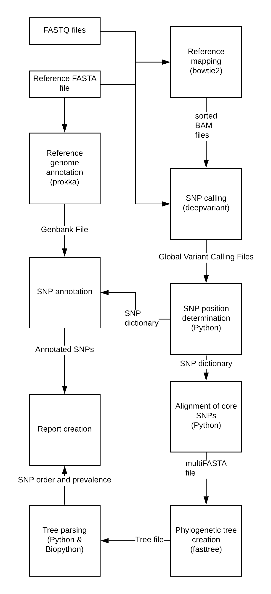

# What is the COWSNPhR?

The Canadian Food Inspection (CFIA) Ottawa Laboratory Network (OLN) Workflow for Single Nucleotide Phylogeny Reporting, or, COWSNPhR is a pipeline that can detect single nucleotide variants in bacterial NGS data. 

### How Does COWSNPhR Work?

Query Illumina FASTQ reads are mapped against a reference genome with bowtie2. Deepvariant is used to create global VCF files, from which core SNVs are extracted. Phylogenetic analyses are performed with fasttree. User-friendly reports are provided.

### Feedback

If you run into any issues installing or running COWSNPHr, have feature requests, want some help interpreting results, or
anything else, feel free to open an issue on GitHub or send me an email at `adam.koziol@canada.ca`.
