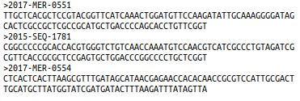
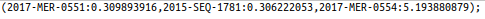
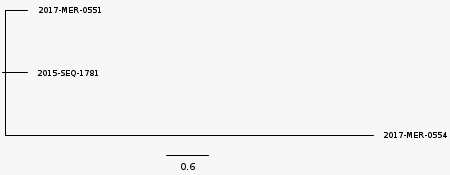
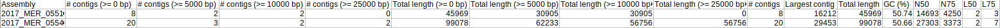
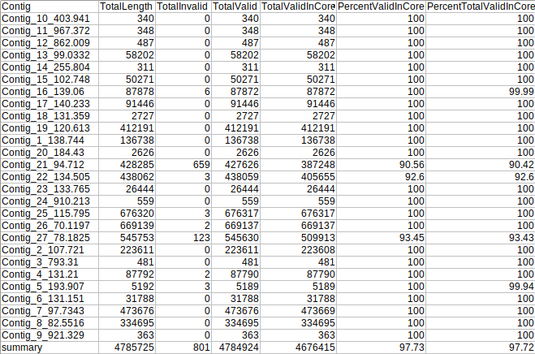
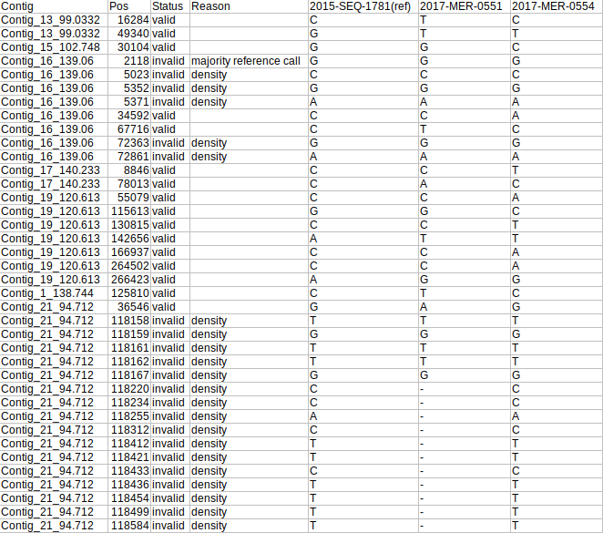
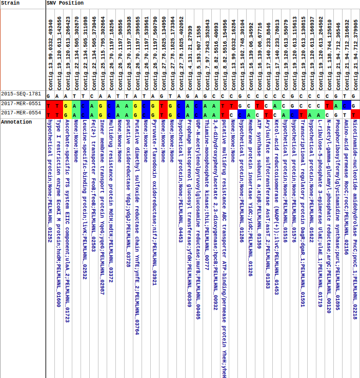
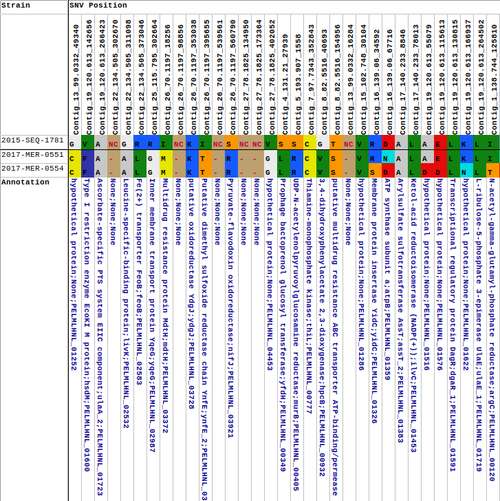

## Required Arguments

```
-s SEQUENCE_PATH, --sequence_path SEQUENCE_PATH
                      Path to folder containing sequencing reads
-r REFERENCE_PATH, --reference_path REFERENCE_PATH
                      Provide the location of the folder containing the reference genome FASTA
```

You can supply absolute or relative paths. Therefore, from your current working directory you could process 
sequences in the `fastq` folder against the FASTA reference in the `ref` folder with either of the following two commands:

`cowsnphr -s fastq -r ref`

`cowsnphr -s /path/to/fastq -r /path/to/ref`

## Optional Arguments

COWSNPhR has a few optional arguments that allow you to modify its other parameters. Optional arguments are:

```
-h, --help            show this help message and exit
-v, --version         show program's version number and exit
-t THREADS, --threads THREADS
                      Number of threads. Default is the number of cores in the system - 1
-d, --debug           Enable debugging-level messages to be printed to the terminal
-w WORKING_PATH, --working_path WORKING_PATH
                      If you are running these analyses anywhere other than your $HOME directory, you will 
                      need to provide the path to the drive e.g. /mnt/nas. This is necessary for the docker 
                      calls to deepvariant. An additional volume will be mounted in the docker container: 
                      e.g. -v /mnt/nas:/mnt/nas
-m MASKFILE, --maskfile MASKFILE
                      Supply a BED-formatted file with regions to mask. Generally, the format is: chrom 
                      chromStart chromEnd where chrom is the name of the reference chromosome;
                      chromStart is the Start position of the feature in standard chromosomal coordinates 
                      (i.e. first base is 0); chromEnd is the End position of the feature in
                      standard chromosomal coordinates
-g, --gpu             Enable this flag if your workstation has a GPU compatible with deepvariant. 
The program will use the deepvariant-gpu Docker image instead of the regular
                      deepvariant image. Note that since I do not have a setup with a GPU, this is COMPLETELY UNTESTED!

```

## Example Outputs

Running the following command (note that the debug option has been enabled):

`cowsnphr.py -s /Bioinformatics/COWSNPhR/fastq -r /Bioinformatics/COWSNPhR/ref -d`

with two paired FASTQ samples (2017-MER-0551, 2017-MER-0554) against FASTA reference 2015-SEQ-1781

If COWSNPhR is properly installed, you should see something similar to the following appear on your terminal:

```bash
2020-09-17 19:40:55 Welcome to COWSNPhR version 0.0.30
2020-09-17 19:40:55 Supplied sequence path: 
/Bioinformatics/COWSNPhR/fastq
2020-09-17 19:40:55 Supplied reference path: 
/Bioinformatics/COWSNPhR/ref
2020-09-17 19:40:55 Locating FASTQ files, creating strain-specific working directories and symlinks to files
2020-09-17 19:40:55 FASTQ files: 
/Bioinformatics/COWSNPhR/fastq/2017-MER-0551_S1_L001_R1_001.fastq.gz
/Bioinformatics/COWSNPhR/fastq/2017-MER-0551_S1_L001_R2_001.fastq.gz
/Bioinformatics/COWSNPhR/fastq/2017-MER-0554_S1_L001_R1_001.fastq.gz
/Bioinformatics/COWSNPhR/fastq/2017-MER-0554_S1_L001_R2_001.fastq.gz
2020-09-17 19:40:55 Extracting paths to reference genomes
2020-09-17 19:40:55 Running bowtie2 build
2020-09-17 19:40:58 Creating .fai index file of 2015-SEQ-1781
2020-09-17 19:40:58 Running bowtie2 reference mapping
2020-09-17 19:58:25 Indexing sorted BAM files
2020-09-17 19:58:30 Extracting unmapped reads
2020-09-17 19:59:03 Attempting to assemble unmapped reads with SKESA
2020-09-17 20:02:11 Running Quast on SKESA assemblies
2020-09-17 20:02:23 Preparing files for SNP calling with deepvariant make_examples
2020-09-17 20:35:56 Calling variants with deepvariant call_variants
2020-09-17 20:38:28 Creating VCF files with deepvariant postprocess_variants
2020-09-17 20:38:36 Copying gVCF files to common folder
2020-09-17 20:38:36 Parsing gVCF files
2020-09-17 20:38:37 Loading SNP positions
2020-09-17 20:38:37 Performing SNP density filtering
2020-09-17 20:38:37 Masking low complexity and repeat regions in reference genomes
2020-09-17 20:38:47 Extracting coordinates to mask
2020-09-17 20:38:47 Filtering SNPs in masked regions
2020-09-17 20:38:47 Loading SNP sequences
2020-09-17 20:38:47 Removing identical SNP positions from group
2020-09-17 20:38:47 Creating multi-FASTA files of core SNPs
2020-09-17 20:38:47 Summarising SNPs
2020-09-17 20:39:02 Creating phylogenetic trees with FastTree
2020-09-17 20:39:02 Parsing strain order from phylogenetic trees
2020-09-17 20:39:02 Copying phylogenetic trees to /Bioinformatics/COWSNPhR/fastq/tree_files
2020-09-17 20:39:02 Creating GenBank file for 2015-SEQ-1781 as required
2020-09-17 20:44:15 Loading GenBank files for closest reference genomes
2020-09-17 20:44:17 Annotating SNPs
2020-09-17 20:44:17 Counting prevalence of SNPs
2020-09-17 20:44:17 Determining amino acid sequence at SNP locations
2020-09-17 20:44:17 Creating SNP matrix
2020-09-17 20:44:17 Ranking SNPs based on prevalence
2020-09-17 20:44:17 Sorting SNPs based on order of strains in phylogenetic trees
2020-09-17 20:44:17 Creating summary tables
2020-09-17 20:44:18 Analyses Complete!

```

## Interpreting COWSNPhR Results

COWSNPhR produces several output files:

#####Core SNV alignment:

`alignment.fasta` in the `fastq/alignments` folder

This is a multi-FASTA of the extracted core SNVs, and is used by fasttree to generate phylogenetic trees



#####Phylogenetic tree:

`best_tree.tre` in the `fastq/alignments` folder

An approximately-maximum-likelihood phylogenetic tree generated by fasttree from the core SNV alignment



when viewed with figtree:




##### SNV Matrix

`species_group_snv_matrix.tsv` in `fastq/snv_matrix`

A matrix displaying the number of SNVs observed between each sample in the analysis


##### Assembly report

`assembly_report.tsv` in `fastq/summary_tables` folder

Quast-generated report of the raw statistics of contigs created from unmapped reads



##### Contig Summary

`contig_summary.tsv` in `fastq/summary_tables` folder

Reference genome per-contig summary.

- `Contig` - name of reference contig
- `TotalLength` - length of contig
- `TotalInvalid` - number of positions determined to be invalid (due to low quality, high density, user-provided mask, insufficient coverage, or low allele fraction)
- `TotalValid` - number of valid positions (all positions that were not determined to be invalid)
- `TotalValidInCore` - number of valid positions in the calculated core genome (composed of genome sequence that is present in all samples)
- `PercentValidInCore` - `TotalValidInCore / TotalValid * 100`
- `PercentTotalValidInCore` - `TotalValidInCore / TotalLength * 100`

Note: this is a summary row at the bottom of the file



##### SNV Summary

`snv_summary.tsv` in `fastq/summary_tables` folder

Summary of every SNV position

- `Contig` - name of reference contig
- `Pos` - SNV position in reference contig
- `Status` - position is valid/invalid
- `Reason` - the reason(s) a position is invalid
- `2015-SEQ-1781(ref)` - the sequence of the position in the reference genome
- `2017-MER-0551` - the sequence of the position in the query genome
- `2017-MER-0554` - the sequence of the position in the query genome



##### Nucleotide Summary Table

`nt_snv_sorted_table.xlsx` in `fastq/summary_tables`

Summary of the sorted nucleotide SNVs

- `Strain` - name of the strain. The reference strain is the top strain
- `SNV Position` - Contig name_position, reference sequence: colour-coded strain sequences, annotation of the region of the reference genome in which the SNV is located



##### Amino Acid Summary Table

`aa_snv_sorted_table.xlsx` in `fastq/summary_tables`

Summary of the translated sorted SNVs

- `Strain` - name of the strain. The reference strain is the top strain
- `SNV Position` - Contig name_position, colour-coded reference sequence (NC indicates that the position is not in a coding region): colour-coded strain sequences, annotation of the region of the reference genome in which the SNV is located


